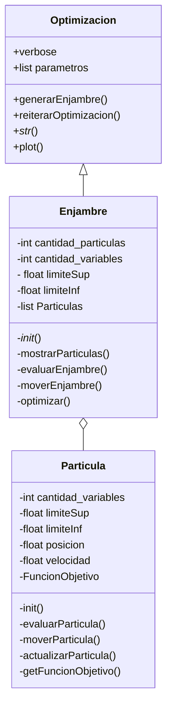
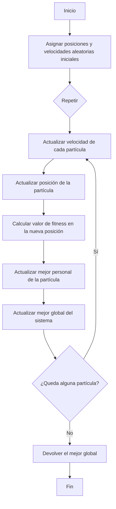

# Algoritmo PSO
### Integrantes: 
| Nombre | ID |
|---|---|
| Alejandro Bello | 1013037759 |
| Malcolm Carrillo | 1010962608 |
| Rafael Chirivi | 1034661580 |

Get ready to see the great logo: 

<figure>  
<figcaption><b> "we are programmers, not designers" </b></figcaption></figure>

 

### Planteamiento del problema 
El PSO u optimización por enjambres de partículas, es un algoritmo y metaheurística que maximiza o minimiza funciones de "caja negra" lo que significa que aunque puntos pueden ser evaluados, no se conoce la expresión que la define: bajo este supuesto, optimizar la función consumiría una cantidad de recursos de tiempo y memoria importantes, sin embargo, lo que propone el algoritmo es realizar un "lanzamiento" de un selecto grupo de partículas que se espera encuentren la optimización deseada a partir de una posición aleatoria, para luego verse afectadas por una velocidad, inercia, aceleración, y dos variables que serán la mejor posición local, y la mejor posición global. Mientras mas lanzamientos se realizan, el enjambre tenderá a seguir una misma ruta en donde se ha encontrado una máximo o mínimo, y si bien al tratarse de un metaheurística no asegura una optimización global al estar atado a parámetros establecidos por el usuario y procedimientos propios del código, ofrece una alternativa útil para funciones "fitness" por los valles y colinas que presentan y por donde las partículas desarrollan sus trayectorias.

### Diagrama de clases
Acá presentamos la abstracción general de las clases que interactúan para darle forma al algortimo PSO, con sus respectivo métodos para poder obtener el resultado eserado según los parametros que se ingresen

### Diagrama de flujo
EL siguiente diagrama de flujo muestra el funcionamiento general del Algoritmo, incluyendo los procesos que se llevan a cabo con cada particula para llegar al resultado que se espera.

### Alcance esperado
La optimización de funciones matemáticas complejas puede ser algo complejo, sin embargo, mediante este algortimo es posible estimar `maximos` y `minimos`.
Algunos [ejemplos](https://www.geogebra.org/m/wdcms7bu) de funciones que pueden ser tratadas con este algoritmo.
